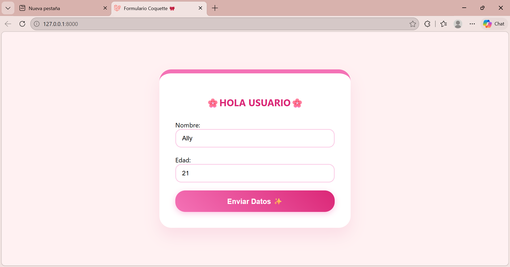
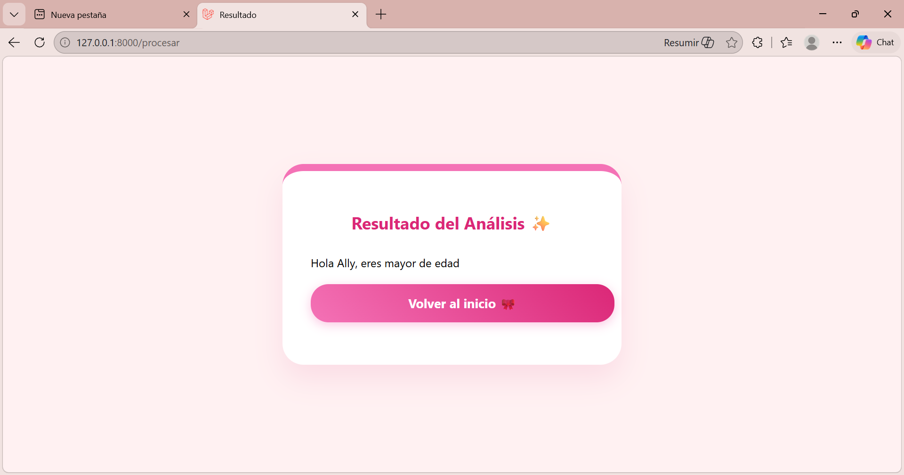

# 🌸 Proyecto: Verificador de Edad Coquette 🎀

¡Bienvenida/o! Este es mi primer proyecto web desarrollado con **Laravel 11**. Es una aplicación sencilla pero con mucho estilo que procesa datos de usuario para determinar la mayoría de edad.

## ✨ Características Técnicas
- **Backend:** PHP con el framework Laravel. 🐘
- **Frontend:** Vistas con el motor de plantillas **Blade**. 🎨
- **Estilos:** CSS3 puro con variables, Flexbox y animaciones personalizadas. 👗
- **Control de Versiones:** Gestionado con Git y GitHub. ⏳

## 📸 Screenshots
### El Formulario

### El Resultado

## 🛠️ Cómo lo construí
1. Configuré las **Rutas** en `web.php` para manejar peticiones GET y POST.
2. Diseñé la interfaz en archivos `.blade.php` dentro de `resources/views`.
3. Creé un archivo CSS independiente en `public/css` para separar la estructura del diseño.